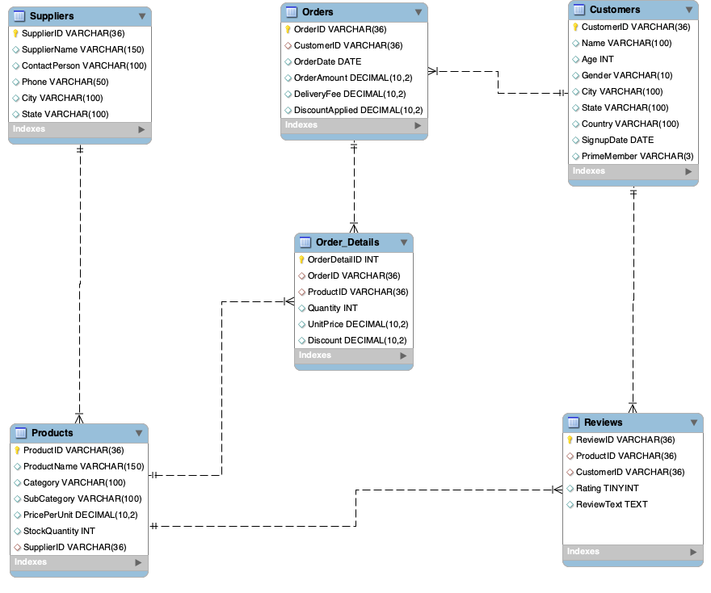

# Amazon Fresh Analytics 🛒

This project analyzes **Amazon Fresh customer and sales data** using SQL.  
It covers **database design, data normalization, complex queries, and insights** into customer behavior, sales, and product performance.  

---

## 📊 Entity-Relationship Diagram (ERD)


---

## 📑 Dataset Overview
The project uses **6 CSV files** as input datasets:

- **Customers** – customer demographics, location, Prime membership.  
- **Orders** – order details, dates, amounts, delivery fees.  
- **Order_Details** – line items for each order, quantities, unit prices, discounts.  
- **Products** – product catalog with categories, subcategories, suppliers.  
- **Suppliers** – supplier details and locations.  
- **Reviews** – customer reviews with ratings and text feedback.  

---

## ⚙️ SQL Workflow
The `amazon_fresh_main.sql` script includes:

1. **Database Setup**
   - Create tables (Customers, Orders, Order_Details, Products, Suppliers, Reviews).
   - Normalization of `Products` table (to 3NF: Categories & SubCategories).

2. **Data Insertion**
   - Insert sample records for testing.
   - Import CSV datasets.

3. **Basic Queries**
   - Select customers from a specific city.  
   - Fetch products by category.  
   - Update product stock & delete records conditionally.  

4. **Constraints**
   - Ensure ratings are between 1 and 5.  
   - Default value for PrimeMember = "No".  

5. **Complex Aggregations & Joins**
   - Orders placed after a given date.  
   - Products with average rating > 4.  
   - Rank products by total sales.  
   - Total spending per customer.  
   - Identify high-value customers.  
   - Total revenue per order.  
   - Customers with most orders (2025).  
   - Supplier with most stock.  

6. **Analytical Insights**
   - Top 3 products by revenue.  
   - Customers who never placed an order.  
   - Cities with highest Prime concentration.  
   - Top 3 most frequently ordered categories.  

---

## 📈 Key Insights
- **Top products by revenue**: Fall Snack, Close Vegetable, Study Snack.  
- **High-value customers** spend **> ₹70K**, dominated by Michael Garcia & Kristopher Douglas.  
- **Prime Members** are most concentrated in New David, Josephport, East Kristine.  
- **Most ordered categories**: Meat, Fruits, Snacks.  
- Some customers exist in the database but **never placed orders** (potential churn).  

---

## 📑 Deliverables
- `amazon_fresh_main.sql` → End-to-end SQL code.  
- `amazon-fresh-analytics.pdf` → Presentation with query screenshots & insights.  
- `amazon_fresh_erd.png` → ERD for database structure.  
- `data/` → Reference CSVs for reproducibility.  

---

## 🚀 How to Run
1. Clone this repository:
   ```bash
   git clone https://github.com/your-username/amazon-fresh-analytics.git
   cd amazon-fresh-analytics
